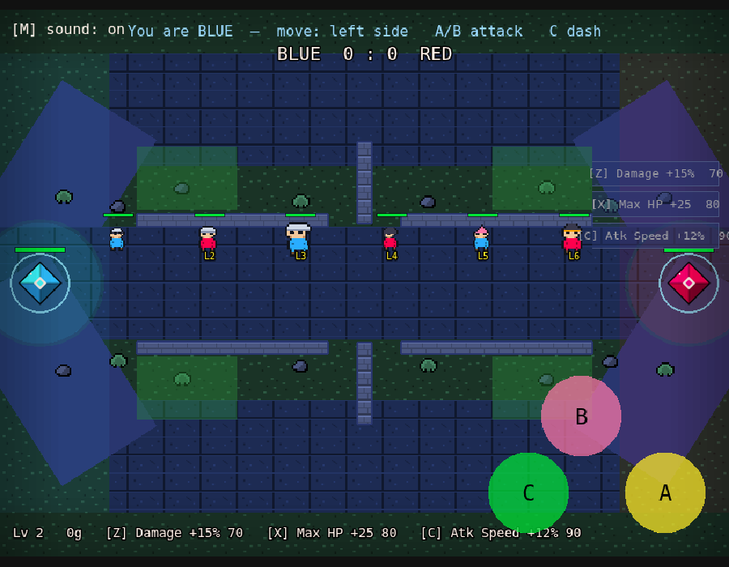
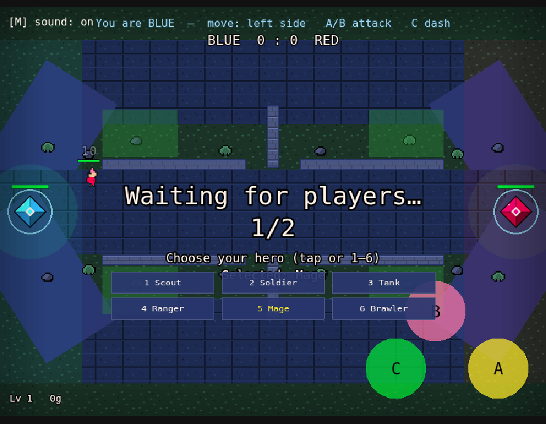
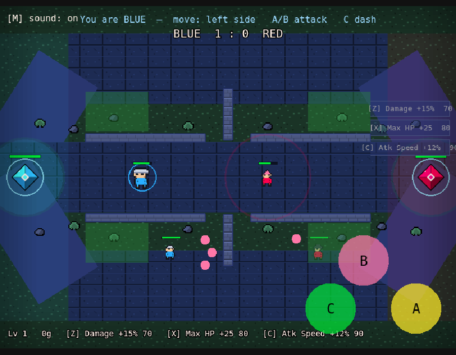
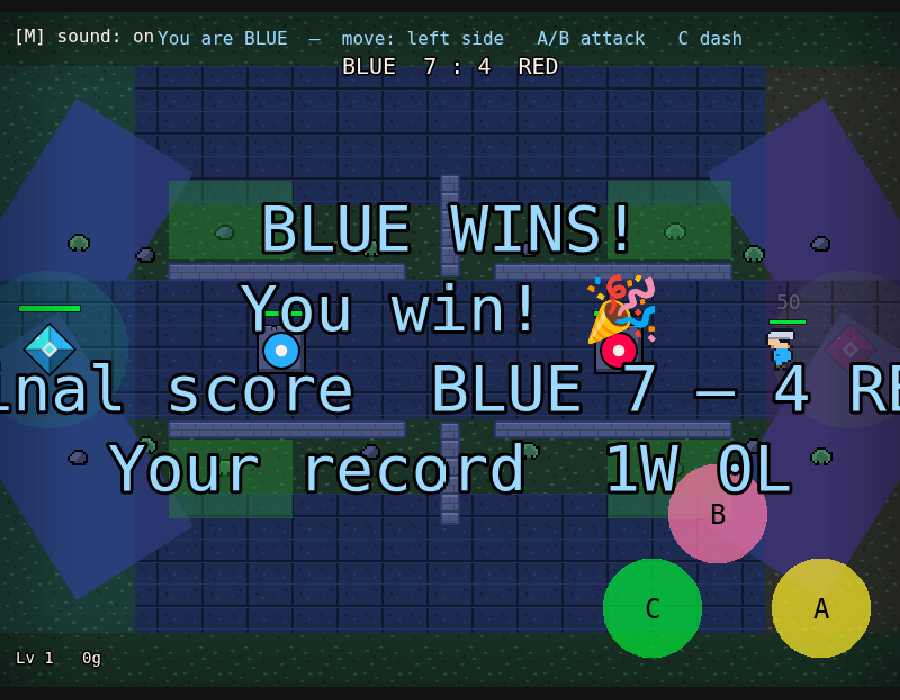

# PixelClash 🟦⚔️🟥

A pixel-art, browser-first **MOBA arena battler**. Pick one of **six heroes**,
push **three lanes** of minions past the enemy's guard towers, clear **jungle
camps** for buffs, ambush from the **bushes**, level up and shop for upgrades —
and raze the enemy base to win. Play **solo against AI bots** in one click, or
open a second tab for a real 1v1 (scales toward 3v3).


- **Game engine:** [Phaser 3](https://phaser.io) (HTML5, runs in any browser)
- **Dev server / bundler:** [Vite](https://vitejs.dev)
- **Multiplayer:** a small **server-authoritative** WebSocket server (Node + [`ws`](https://github.com/websockets/ws))
- **Art & sound:** every sprite is **drawn in code** and every sound is
  **synthesized** at runtime — zero asset files, all license-free.

Everything is free and runs on your own machine — no accounts, no credit card.

## What's in it

- **6 hero classes** — Scout, Soldier, Tank, Ranger, Mage, Brawler, each with its
  own sprite, health, and attack profile — **plus a unique B ability** (a pellet
  spread, a piercing bolt, a damage-soaking shield, a homing arrow, an AoE nova,
  and a leap slam — one per hero, not just a bigger shot).
- **3 lanes** (top / mid / bottom) of AI minion waves, with a **guard tower** on
  every lane — six per side.
- **Tower-gated bases** — a base is shielded until all its towers fall.
- **Gold & leveling** — last-hit for XP/gold, auto-level, and a shop (damage /
  max-HP / attack-speed upgrades).
- **A real map** — distinct stone-lane vs mossy-jungle terrain, **neutral jungle
  camps** that give a buff when cleared, and **stealth bushes** for ambushes.
- **Map pickups** (heal / power orbs) and a **base healing fountain**.
- **AI bots** so you can play solo instantly; a match timer with a kill tiebreak.
- **Full HUD** — team scoreboard, match clock, kill feed, respawn timer, and a
  per-hero level/gold/shop line.
- **Mobile-ready** — touch joystick + buttons, a tap-to-start gate, and tappable
  class/shop pickers.
- **Game Boy / Pokemon-Zelda style pixel art** — top-down chibi heroes with
  4-direction facing and a 2-frame walk shuffle, plus procedural animation (idle
  bob, attack pop, death tumble), all hand-drawn in code (zero asset files).

---

## How to play it on your Mac

You need **two Terminal windows**: one for the game server, one for the web
page. (A "Terminal" is the Mac app where you type commands — open it with
`Cmd+Space`, type `Terminal`, Return.)

### First time only

```bash
cd ~/Desktop
git clone https://github.com/4305labs/pixelclash.git
cd pixelclash
git checkout claude/pixel-moba-game-WobPa
npm install
```

> `npm install` prints some "vulnerabilities"/"funding" notes — that's normal,
> ignore them. Only red `npm ERR!` lines are real problems.

### Every time you want to play

**Terminal window 1 — the game server:**
```bash
cd ~/Desktop/pixelclash
npm run server
```
You should see: `PixelClash server listening on ws://localhost:2567`.
Leave this window open. It prints a line whenever a player joins or leaves.

**Terminal window 2 — the web page:**
```bash
cd ~/Desktop/pixelclash
npm run dev
```
It prints a `Local:` address, usually **http://localhost:5173/**.

**Now open the game:**
1. Open **http://localhost:5173/** in Chrome → you're the **BLUE** player.
   You'll get an **AI bot** opponent automatically, so you can start playing
   solo right away.
2. Want a real 1v1? Open the **same address in a second tab** (or window) →
   that's the **RED** player, and the bot steps aside. Click a tab to control
   that player.

To stop either server: click its Terminal and press `Ctrl + C`.

### Controls

| Action | Keyboard | Touch |
|---|---|---|
| Move | `WASD` or arrow keys | Drag the **left** side of the screen (joystick) |
| Basic attack | `J` or `Space` | Tap the **A** button (bottom-right) |
| Ability (unique per hero) | `K` | Tap the **B** button |
| Dash | `L` or `Shift` | Tap the **C** button |
| Mute / unmute sound | `M` | Tap **[M] sound** (top-left) |
| Pick a hero class (in the lobby) | `1`–`6` | Tap a class button |
| Buy shop upgrades (with gold) | `Z` / `X` / `C` (or `B` for next) | Tap an item button (right edge) |

The first tap or key press dismisses the **"Tap to play"** start gate — this
also unlocks sound (mobile browsers stay silent until you interact).

Attacks **auto-aim** at the nearest enemy — an enemy hero, an enemy **minion**,
or their base. Reduce the enemy **base** (the diamond crystal) to 0 HP to win.
After a win, the match auto-resets in 5 seconds.

**Level up & gold:** last-hitting minions, towers, and enemy heroes (plus a slow
passive trickle) earns **XP** and **gold**. XP levels you up automatically — more
max HP and attack damage — and gold buys permanent upgrades from a small shop:
**Damage**, **Max HP**, and **Attack Speed** (keys `Z` / `X` / `C`). Your level,
gold, and the shop show in the bottom-left.

**Hero classes:** in the lobby, press `1`–`6` (or tap a button) to pick one of
six heroes. Each has its own sprite, health, and attack profile — **and its own
B ability**, which is genuinely different per hero (not just a bigger shot):
- **Scout** — fast-firing but fragile. **Scatter:** a three-pellet spread shot.
- **Soldier** — balanced all-rounder. **Pierce:** a bolt that punches through a
  whole line of enemies.
- **Tank** — beefy, slow, heavy hits (drawn bigger). **Bulwark:** a shield that
  halves incoming damage for a few seconds (cyan ring).
- **Ranger** — long-range poke, glassy. **Seeker:** a homing arrow that curves
  to chase the nearest enemy hero.
- **Mage** — weak basics but a huge burst nuke. **Nova:** a fireball that
  detonates on impact, hitting everything in the blast.
- **Brawler** — short-range dive bruiser, rapid and tough. **Leap Slam:** lunge
  forward and smash everything around the landing.

You can change pick until the match starts.

**Three lanes:** the arena has **top, mid, and bottom** lanes. Once a match
starts, both sides send a wave of AI minions down **every lane**, marching toward
the enemy base and fighting whatever they meet. They're weak alone, but they soak
fire and chip the base — push a lane alongside your wave to break through.

**Guard towers:** each team has a defensive tower on **every lane** (six in
total) between its base and the center. A tower auto-zaps the nearest enemy in
range (orange bolts), so diving in alone is dangerous — let your minions soak the
tower while you whittle it down. **A base is shielded (a glowing ring) and can't
be touched until ALL of its towers are destroyed**, so the towers are the gate to
victory: break a team's towers, then raze the exposed base to win.

**Map pickups:** orbs sit at fixed spots down the center of the arena (fair to
both teams, but contested). Grab a green **heal** orb to restore HP, or an
orange **power** orb to boost your attack damage for a few seconds (you'll glow).
Taken orbs reappear on a timer.

**Healing fountain:** stand on your **own base** (the faint green ring) to regen
HP quickly. Retreating home when low is a real option — but you can't heal and
fight at the front at the same time.

**Jungle camps:** a neutral monster lurks in each jungle pocket. It bites heroes
who get close, but clear it and you bag **gold + XP and a short attack-damage
buff** — a real reason to leave the lane. Camps respawn on a timer.

**Bushes (stealth):** stand in a leafy bush patch to go **hidden** — enemies
(and their towers, minions, and the camps) can't see or target you. Attacking
briefly reveals you, and an enemy stepping into your bush spots you. Bushes sit
right by the jungle camps, so they're perfect for an ambush.

**Scoreboard, clock & respawns:** a team kill scoreboard and a match clock sit at
the top of the screen, recent knockouts scroll by in a corner kill feed, and when
you're knocked out a "Respawning in N…" countdown tells you how long until you're
back. If neither base falls before time runs out, the team ahead on kills wins
(ties broken by base HP — or a draw).

### Play on your phone (same Wi-Fi)

While `npm run dev` is running, it also prints a `Network:` address like
`http://192.168.1.42:5173/`. On a phone connected to the **same Wi-Fi**, open
that address in the phone's browser to join the battle with touch controls —
drag the left side to move, tap the right-side buttons to act, and tap the
class/shop buttons too. **Hold your phone in landscape** for the best view (the
game shows a reminder if you're in portrait).
(If it won't connect, see the troubleshooting note in
[docs/HOW-TO-KEEP-BUILDING.md](docs/HOW-TO-KEEP-BUILDING.md).)

### Play with friends over the internet

Once you've played locally, you can host the game online for free so anyone can
join from anywhere. It's two steps — host the server, point the page at it —
and it's written up plainly in
[docs/HOW-TO-KEEP-BUILDING.md → *Put it online*](docs/HOW-TO-KEEP-BUILDING.md#9-put-it-online-so-friends-can-play).

---

## A look at it

The top image shows the whole arena: three lanes of minions and towers, jungle
camps, stealth bushes (the green patches), heroes, bases, and the HUD.

| The six heroes | Picking a hero (lobby) | Mid-lane clash & shop HUD |
|---|---|---|
|  |  |  |

Each hero's **B ability** is genuinely different — here a tank's shield ring, a
scout's pellet spread, a mage's nova blast, and a homing arrow all at once:



| Lane minions meet | Victory screen | On a phone (landscape) |
|---|---|---|
|  |  |  |

---

## Project layout

```
pixelclash/
├─ index.html              ← the web page that hosts the game
├─ server.js               ← the multiplayer game server (run with: npm run server)
├─ src/
│  ├─ main.js              ← boots Phaser + the network client
│  ├─ config.js            ← ALL the tunable numbers + map layout (one place to balance)
│  ├─ sim.js               ← shared movement math (server + client prediction agree)
│  ├─ textures.js          ← draws every pixel-art sprite in code (no image files)
│  ├─ anim.js              ← procedural animation math (bob / walk / attack pop)
│  ├─ audio.js             ← synthesized sound effects + mute (no audio files)
│  ├─ record.js            ← persisted win/loss/draw tally (localStorage)
│  ├─ scenes/
│  │  └─ ArenaScene.js     ← the playing field: input, rendering, HUD, the map
│  ├─ entities/
│  │  ├─ Player.js         ← on-screen hero (per-class sprite + health bar)
│  │  ├─ Minion.js         ← on-screen lane minion + health bar
│  │  ├─ Tower.js          ← on-screen guard tower + health bar
│  │  ├─ Camp.js           ← on-screen neutral jungle monster + health bar
│  │  └─ Base.js           ← on-screen base crystal (+ shield ring, fountain)
│  ├─ ui/
│  │  ├─ VirtualJoystick.js← touch movement stick
│  │  └─ ActionButton.js   ← touch action buttons
│  └─ net/
│     ├─ GameServer.js     ← authoritative game logic (the "rules" + the tick loop)
│     ├─ NetClient.js      ← browser side: sends input, stores the latest snapshot
│     ├─ WebSocketConnection.js ← real network transport
│     └─ LocalConnection.js     ← in-memory transport (used by tests)
└─ test/                   ← automated tests (you never need these to play)
```

> **Building on it?** Start with **[HANDOVER.md](HANDOVER.md)** — a living guide
> to the architecture, the feature→code map, invariants, and gotchas.

## Running the automated tests (optional)

The tests run the game in a headless browser and exercise the server logic.
They're for development confidence; you don't need them to play.

```bash
npm test
```

> The test harness expects a Chromium browser. If you ever want to run it,
> install one with `npx playwright install chromium` first.

---

## Want to change or extend the game?

See **[docs/HOW-TO-KEEP-BUILDING.md](docs/HOW-TO-KEEP-BUILDING.md)** — it
explains, in plain language, how to tweak balance, add abilities, go 3v3, swap
in real art, and put the game online.
