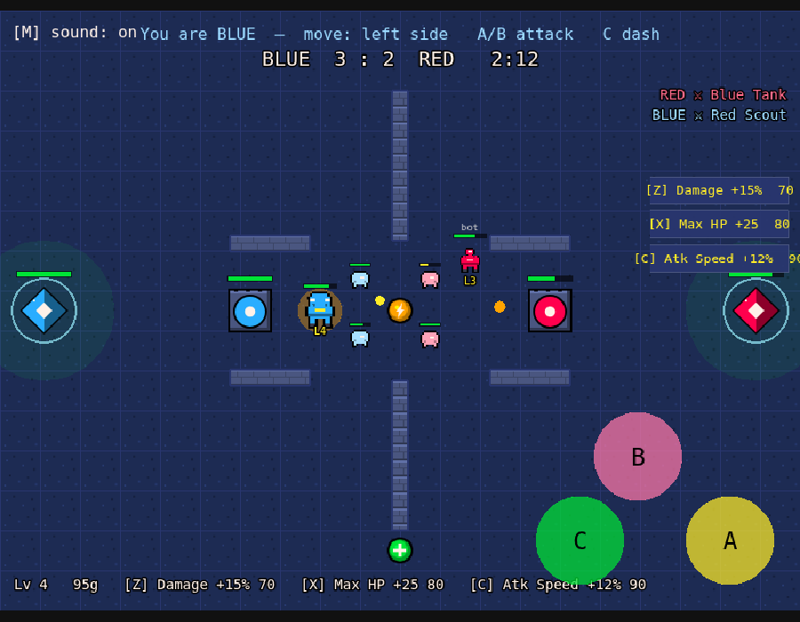
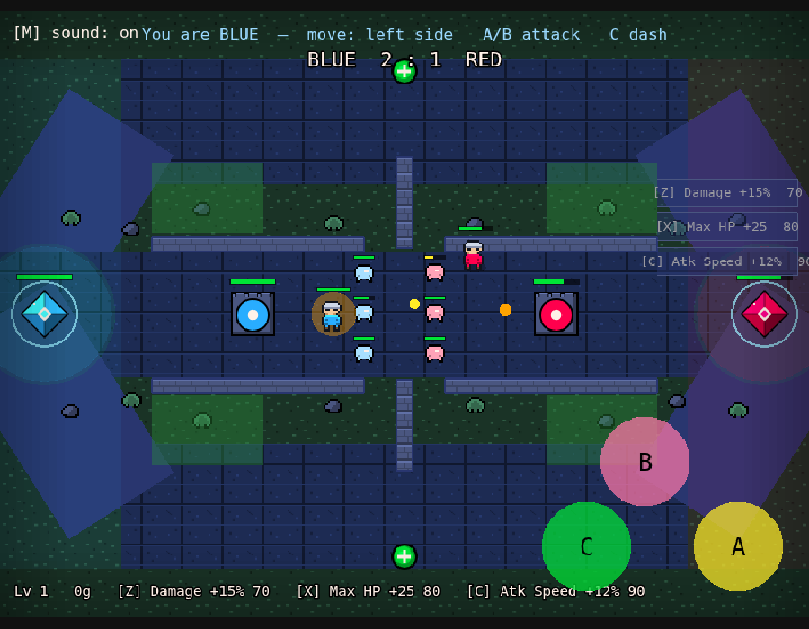
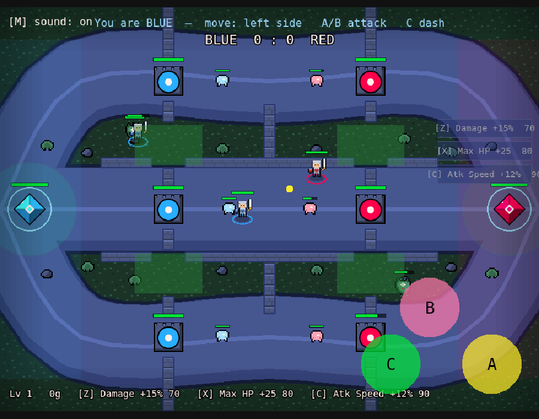
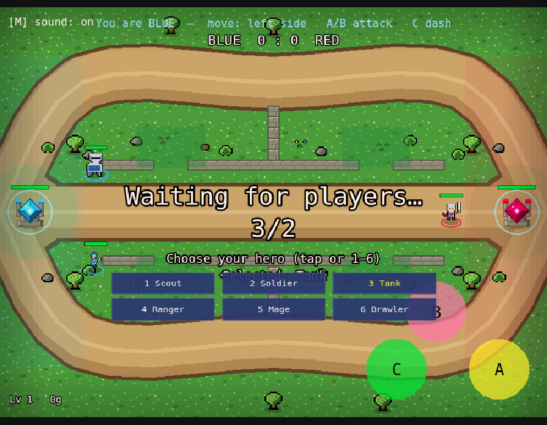
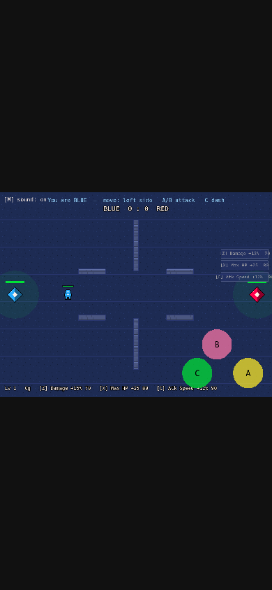

# PixelClash 🟦⚔️🟥

A pixel-art, browser-first **MOBA arena battler**. Move, basic attack, one
ability, dash — and waves of **lane minions** march out to help you push past
the enemy's **guard tower** and tear down their base. Destroy that base to win.
Built to start as **1v1** and grow to **3v3**.



- **Game engine:** [Phaser 3](https://phaser.io) (HTML5, runs in any browser)
- **Dev server / bundler:** [Vite](https://vitejs.dev)
- **Multiplayer:** a small **server-authoritative** WebSocket server (Node + [`ws`](https://github.com/websockets/ws))

Everything is free and runs on your own machine — no accounts, no credit card.

---

## How to play it on your Mac

You need **two Terminal windows**: one for the game server, one for the web
page. (A "Terminal" is the Mac app where you type commands — open it with
`Cmd+Space`, type `Terminal`, Return.)

### First time only

```bash
cd ~/Desktop
git clone https://github.com/4305labs/pixelclash.git
cd pixelclash
git checkout claude/pixel-moba-game-WobPa
npm install
```

> `npm install` prints some "vulnerabilities"/"funding" notes — that's normal,
> ignore them. Only red `npm ERR!` lines are real problems.

### Every time you want to play

**Terminal window 1 — the game server:**
```bash
cd ~/Desktop/pixelclash
npm run server
```
You should see: `PixelClash server listening on ws://localhost:2567`.
Leave this window open. It prints a line whenever a player joins or leaves.

**Terminal window 2 — the web page:**
```bash
cd ~/Desktop/pixelclash
npm run dev
```
It prints a `Local:` address, usually **http://localhost:5173/**.

**Now open the game:**
1. Open **http://localhost:5173/** in Chrome → you're the **BLUE** player.
   You'll get an **AI bot** opponent automatically, so you can start playing
   solo right away.
2. Want a real 1v1? Open the **same address in a second tab** (or window) →
   that's the **RED** player, and the bot steps aside. Click a tab to control
   that player.

To stop either server: click its Terminal and press `Ctrl + C`.

### Controls

| Action | Keyboard | Touch |
|---|---|---|
| Move | `WASD` or arrow keys | Drag the **left** side of the screen (joystick) |
| Basic attack | `J` or `Space` | Tap the **A** button (bottom-right) |
| Ability (Power Shot) | `K` | Tap the **B** button |
| Dash | `L` or `Shift` | Tap the **C** button |
| Mute / unmute sound | `M` | Tap **[M] sound** (top-left) |
| Pick a hero class (in the lobby) | `1`–`6` | Tap a class button |
| Buy shop upgrades (with gold) | `Z` / `X` / `C` (or `B` for next) | Tap an item button (right edge) |

The first tap or key press dismisses the **"Tap to play"** start gate — this
also unlocks sound (mobile browsers stay silent until you interact).

Attacks **auto-aim** at the nearest enemy — an enemy hero, an enemy **minion**,
or their base. Reduce the enemy **base** (the diamond crystal) to 0 HP to win.
After a win, the match auto-resets in 5 seconds.

**Level up & gold:** last-hitting minions, towers, and enemy heroes (plus a slow
passive trickle) earns **XP** and **gold**. XP levels you up automatically — more
max HP and attack damage — and gold buys permanent upgrades from a small shop:
**Damage**, **Max HP**, and **Attack Speed** (keys `Z` / `X` / `C`). Your level,
gold, and the shop show in the bottom-left.

**Hero classes:** in the lobby, press `1`–`6` (or tap a button) to pick one of
six heroes, each with its own sprite, health, and attack profile:
- **Scout** — fast-firing but fragile
- **Soldier** — balanced all-rounder
- **Tank** — beefy, slow, heavy hits (drawn bigger)
- **Ranger** — long-range poke, glassy
- **Mage** — weak basics but a huge burst nuke
- **Brawler** — short-range dive bruiser, rapid and tough

You can change pick until the match starts.

**Lane minions:** once a match starts, both sides periodically send out a small
wave of AI minions that march down the middle toward the enemy base, fighting
whatever they meet. They're weak on their own, but they soak up fire and chip
the base — push alongside your wave to break through.

**Guard towers:** each team has one defensive tower standing in the lane between
its base and the center. A tower auto-zaps the nearest enemy in range (orange
bolts), so diving in alone is dangerous — let your minions soak the tower while
you whittle it down. **A base is shielded (a glowing ring) and can't be touched
until its own tower is destroyed**, so the tower is the gate to victory: break
the tower, then raze the exposed base to win.

**Map pickups:** orbs sit at fixed spots down the center of the arena (fair to
both teams, but contested). Grab a green **heal** orb to restore HP, or an
orange **power** orb to boost your attack damage for a few seconds (you'll glow).
Taken orbs reappear on a timer.

**Healing fountain:** stand on your **own base** (the faint green ring) to regen
HP quickly. Retreating home when low is a real option — but you can't heal and
fight at the front at the same time.

**Scoreboard, clock & respawns:** a team kill scoreboard and a match clock sit at
the top of the screen, recent knockouts scroll by in a corner kill feed, and when
you're knocked out a "Respawning in N…" countdown tells you how long until you're
back. If neither base falls before time runs out, the team ahead on kills wins
(ties broken by base HP — or a draw).

### Play on your phone (same Wi-Fi)

While `npm run dev` is running, it also prints a `Network:` address like
`http://192.168.1.42:5173/`. On a phone connected to the **same Wi-Fi**, open
that address in the phone's browser to join the battle with touch controls —
drag the left side to move, tap the right-side buttons to act, and tap the
class/shop buttons too. **Hold your phone in landscape** for the best view (the
game shows a reminder if you're in portrait).
(If it won't connect, see the troubleshooting note in
[docs/HOW-TO-KEEP-BUILDING.md](docs/HOW-TO-KEEP-BUILDING.md).)

### Play with friends over the internet

Once you've played locally, you can host the game online for free so anyone can
join from anywhere. It's two steps — host the server, point the page at it —
and it's written up plainly in
[docs/HOW-TO-KEEP-BUILDING.md → *Put it online*](docs/HOW-TO-KEEP-BUILDING.md#9-put-it-online-so-friends-can-play).

---

## A look at it

| Full HUD & shop | Lane minions clash | The arena (with walls) | Choosing a hero | On a phone |
|---|---|---|---|---|
|  |  |  |  |  |

---

## Project layout

```
pixelclash/
├─ index.html              ← the web page that hosts the game
├─ server.js               ← the multiplayer game server (run with: npm run server)
├─ src/
│  ├─ main.js              ← boots Phaser + the network client
│  ├─ config.js            ← ALL the tunable numbers (speed, damage, HP, colors…)
│  ├─ textures.js          ← draws the pixel-art sprites in code (no image files)
│  ├─ anim.js              ← procedural animation math (bob / walk / attack pop)
│  ├─ scenes/
│  │  └─ ArenaScene.js     ← the playing field: input, rendering, HUD
│  ├─ entities/
│  │  ├─ Player.js         ← on-screen player + health bar
│  │  ├─ Minion.js         ← on-screen lane minion + health bar
│  │  ├─ Tower.js          ← on-screen guard tower + health bar
│  │  └─ Base.js           ← on-screen base crystal + health bar
│  ├─ ui/
│  │  ├─ VirtualJoystick.js← touch movement stick
│  │  └─ ActionButton.js   ← touch attack buttons
│  └─ net/
│     ├─ GameServer.js     ← authoritative game logic (the "rules")
│     ├─ NetClient.js      ← browser side: sends input, stores snapshots
│     ├─ WebSocketConnection.js ← real network transport
│     └─ LocalConnection.js     ← in-memory transport (used by tests)
└─ test/                   ← automated tests (you never need these to play)
```

## Running the automated tests (optional)

The tests run the game in a headless browser and exercise the server logic.
They're for development confidence; you don't need them to play.

```bash
npm test
```

> The test harness expects a Chromium browser. If you ever want to run it,
> install one with `npx playwright install chromium` first.

---

## Want to change or extend the game?

See **[docs/HOW-TO-KEEP-BUILDING.md](docs/HOW-TO-KEEP-BUILDING.md)** — it
explains, in plain language, how to tweak balance, add abilities, go 3v3, swap
in real art, and put the game online.
